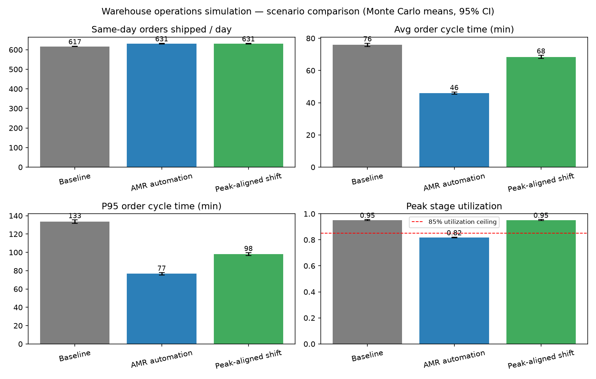
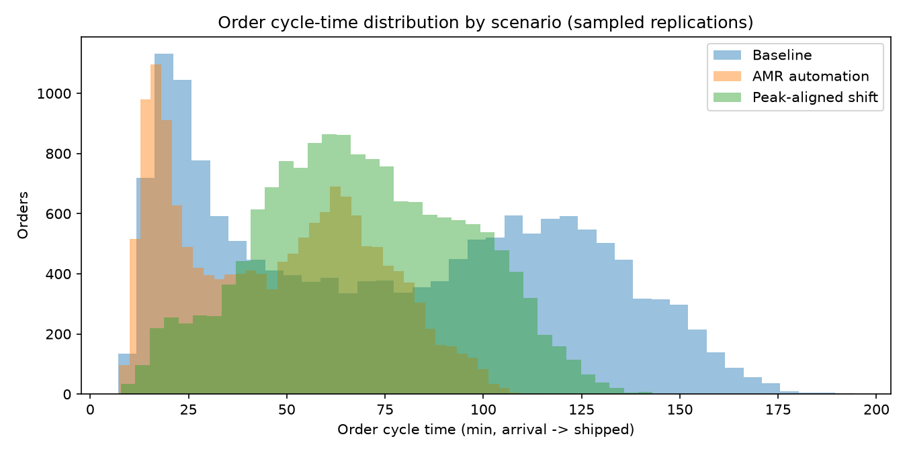

# Warehouse Operations Simulation — Labor Management & Automation

A discrete-event simulation (DES) of a warehouse order pipeline —
**receiving → picking → packing → shipping** — built with SimPy to test
labor plans, shift policies, and automation (autonomous mobile robots)
against peak-day demand. Monte Carlo replications quantify throughput,
order cycle time, and labor utilization risk, so staffing plans can be
chosen that keep utilization below an 85% planning ceiling while meeting
same-day ship targets.

## Methodology

- **Discrete-event model (SimPy).** Each order is an entity flowing
  through four stages. Every stage is staffed by a labor pool; an order
  seizes one worker, is processed for a stochastic service time, and
  releases the worker. Queues form naturally when demand exceeds stage
  capacity.
- **Demand.** Orders arrive as a non-homogeneous Poisson process
  (thinning algorithm) over 08:00–16:00 with a peak-day profile rising
  to 104 orders/hour at midday — ~632 orders/day in expectation. Order
  size (lines) is drawn per order and drives picking work.
- **Service times.** Lognormal with stage-specific means and
  coefficients of variation. Picking is modeled per line (1.8 min/line
  manual vs 1.08 min/line AMR-assisted).
- **Staffing schedules.** Headcount can vary by time of day, which is
  how shift policies are represented. Workers finish their current task
  before going off-shift.
- **Monte Carlo.** 500 independent simulated days per scenario (seeded
  RNG; common random numbers across scenarios for sharper comparisons).
  Metrics are reported as means with 95% confidence intervals.
- **Order cycle time** = time from order arrival to shipped; orders
  shipping after the 18:00 shift end count against the same-day target.
  **Utilization** = busy staff-minutes ÷ scheduled staff-minutes.

## Scenarios compared

| Scenario | Change vs baseline |
|---|---|
| **Baseline labor plan** | 10 pickers, flat 10-hour shift, manual pick-to-cart |
| **AMR-assisted picking (automation)** | Autonomous mobile robots bring goods to stationary pickers: pick time −40% per line, picking crew 10 → 7 |
| **Peak-aligned shift (shift policy)** | Same total picker labor-hours, re-timed: 7 pickers early/late, 13-picker surge 10:30–15:30 across the demand peak |

All other stages keep baseline staffing (receiving 6, packing 6,
shipping 5) so differences are attributable to the change being tested.

## Results (500 replications per scenario, seed 20260930)

| Metric (daily mean) | Baseline | AMR automation | Peak-aligned shift |
|---|---:|---:|---:|
| Orders arriving | 631 | 631 | 631 |
| **Same-day shipped (by 18:00)** | 617 | **631 (+2.3%)** | **631 (+2.3%)** |
| Same-day ship rate | 97.8% | 100.0% | 100.0% |
| **Avg order cycle time** | 75.9 min | **46.0 min (−39.4%)** | 68.4 min (−9.9%) |
| P95 order cycle time | 133 min | **77 min (−42.6%)** | 98 min (−26.5%) |
| Avg wait for a picker | 55.8 min | 27.3 min | 36.6 min |
| Picking utilization | 95.1% | 81.5% | 95.1% |
| Peak stage utilization | 95.1% | **81.7%** | 95.1% |
| Last order ships (makespan) | 613 min | 540 min | 560 min |

Key findings:

1. **The baseline plan is capacity-fragile at peak.** Picking runs at
   ~95% utilization on peak days — well above the 85% planning ceiling —
   so queues build through midday, P95 cycle time reaches 133 minutes,
   and ~2% of orders miss the same-day cutoff.
2. **AMR-assisted picking removes the bottleneck.** Removing fetch
   travel from the picker's task (and staffing 7 pickers instead of 10)
   cuts average cycle time ~39% and P95 ~43%, restores a 100% same-day
   ship rate, and brings peak utilization to 81.7% — below the 85%
   ceiling with a smaller crew.
3. **The peak-aligned shift is the zero-capex lever.** With identical
   total picker labor-hours, average utilization is unchanged *by
   construction* (same work, same scheduled minutes); the benefit
   appears where it matters — wait time, P95 cycle time (−27%), and
   same-day ships. Re-timing labor helps the tail, automation changes
   the structure.





## Notes on scope and honesty

- All demand and process parameters are **synthetic**, calibrated to
  plausible warehouse values — this model is not fitted to real
  operational data.
- This is the open-source (SimPy/Python) implementation of the warehouse
  simulation work described on my resume, which was modeled in
  AnyLogic; SimPy is the code-based equivalent DES engine. Scenario
  results here will not match any specific AnyLogic run.
- Simplifications: stages are single-step (no sub-processes such as
  putaway or QC), workers within a stage are interchangeable, no breaks
  or absenteeism, no equipment downtime, and facility-layout
  alternatives are not modeled — the comparison is scoped to labor
  plans, shift policy, and AMR automation.

## How to run

```bash
pip install -r requirements.txt
python run_simulation.py              # 500 replications per scenario (~2 min)
python run_simulation.py --reps 100   # quicker run
```

Outputs land in `outputs/`: per-scenario summary CSV, full
per-replication results, sampled per-order cycle times, a JSON bundle
(configs + results + headline deltas), and two figures.
`notebooks/01_results_analysis.ipynb` walks through the results.

## Tech stack

Python · SimPy (discrete-event simulation) · NumPy · pandas · matplotlib

## Project structure

```
warehouse-operations-simulation/
├── src/
│   ├── warehouse_sim.py   # SimPy DES model: 4-stage pipeline, staffing schedules
│   ├── scenarios.py       # baseline / AMR automation / peak-aligned shift plans
│   └── experiments.py     # Monte Carlo runner, aggregation, headline deltas
├── notebooks/
│   └── 01_results_analysis.ipynb   # executed results walkthrough
├── outputs/               # generated summaries, replication data, figures
├── run_simulation.py      # entry point (writes outputs/, prints headlines)
├── requirements.txt
└── BUILD_NOTES.md         # build log: what was run and verified
```
